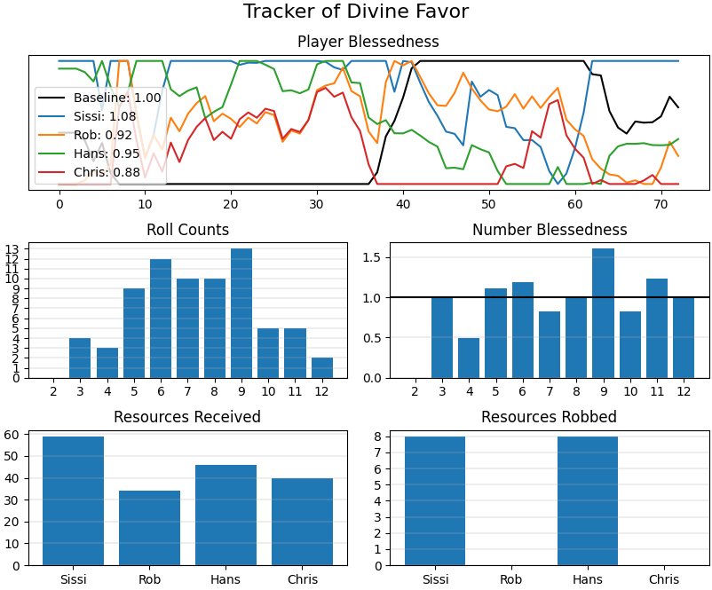

**Do you ever wonder**, during a game of Catan, just how mad at God you deserve to be?  The answer is yes.  And now you can find out!



Here you can see that Chris, poor sod that he is, is the least blessed player.  The tracker shows that Chris, no doubt atoning for his cosmic transgressions, has received the fewest resources per his holdings on the board.  Sissi, on the other hand, has received the most.  In fact, Sissi's *blessedness* surpasses the **baseline** *blessedness*, which means she's received *more* resources from her holdings than can be reasonably expected in a fair and just universe (in which we do not live); a clear indication of providence.

## How it works

### Player *Blessedness*
The tracker determines a player's metaphysical good graces by recording how many resources they *receive* vs how many resources they are *"owed"*.

On every roll, the amount of resources a player is *"owed"* increases per each of their holdings, by the probability that the roll will match the holding.  Cities count as two holdings, and multiple settlements on the same hex each count individually.

For instance, if a player has a settlement on a 4, 6, and 9, on each roll their amount *"owed"* will increase by:

```
3/36 + 5/36 + 4/36 = 0.3333
```

since each of those terms represent the chance of rolling a 4, 6, or 9, respectively.  If that player had a *city* in the same location, they would be *"owed"* twice as much.

Additionally, on every roll, the amount of resources a player *receives* increases by `1` per each of their holdings that matches the value of the roll.

Player *blessedness* is calculated as `received / "owed"`.  The **baseline** *blessedness* indicator sits at `1.0`, a taunting glimpse into a universe in which everyone gets what they're owed.

### Number *Blessedness*
Any seasoned Catan player knows that reading the ju-ju of the numerical landscape is a major skill of the game.  Number *blessedness* works very similarly to player *blessedness*, but the calculation per number is instead `times rolled / "owed"`.

Numbers that are blessed above `1.0` are hotter than they "should" be, and numbers that are below are colder than they "should" be.

## Installation

### Requirements
This program requires you to have a working Python 3 installation, and matplotlib.

You can install matplotlib with `pip`:
```
pip install matplotlib
```

If you need help with either of those things, there is plenty of information out there.

### Installation
Nothing fancy, installation-wise; just put the script `tracker.py` somewhere you'll be able to find it.  You could clone the repository with:
```
git clone https://github.com/cdbfoster/catan-tracker
```

## Usage

### Run the script
To use, run the script:
```
python tracker.py
```

If all goes well, you should see an empty tracker window open, and your terminal should be waiting for commands:
```
$ python tracker.py
Command (h for help):
```

The options should be sufficiently explained by the help text (`h` command).  In any case, here's a rundown on the usage:

### Add players
All players must be added before the first roll.  Add each player with the `p` command:
```
p Chris
```
Names are case-sensitive.

### Add holdings
You must record each holding each player has.  For instance, if a player places their first settlement on the intersection of a 5 hex, 6 hex, and 3 hex, they have 3 holdings: 5, 6, 3, and that can be recording with the following 3 `a` commands:
```
a Chris 5
a Chris 6
a Chris 3
```
Record the new holdings a player adds every time they build a settlement, even if you've recorded a holding for a single number hex before; two settlements on the same hex count as two holdings.  Cities also count as two holdings per hex that they border.

### Record rolls
Record rolls simply by entering the number that was rolled.  If a 6 is rolled, type
```
6
```
followed by the return key.

### Moving the robber
When the robber moves, record the holdings which the robber will prevent from receiving resources with the `r` command.  For instance, if the robber is placed on a 6 hex, on which Chris has a city and Hans has a settlement, the robber's stolen holdings can be recorded with the following commands:
```
r Chris 6
r Chris 6
r Hans 6
```

When the robber moves to a new location, use the `r` command with no arguments to clear the robber's stolen holdings before recording the new ones:
```
r
```

To record the effect of stealing a resource card from a player, use the `r` command, followed by the player being stolen from, followed by the player doing to the stealing.  If Hans steals from Chris, that'd be:
```
r Chris Hans
```

### Help
The `h` command provides a summary of all the commands in the program, including more that weren't covered in the above explanations.
